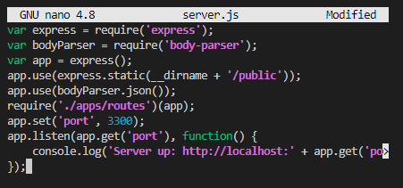
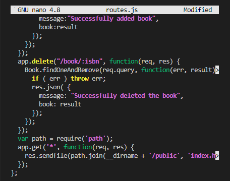
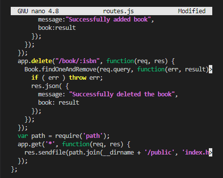
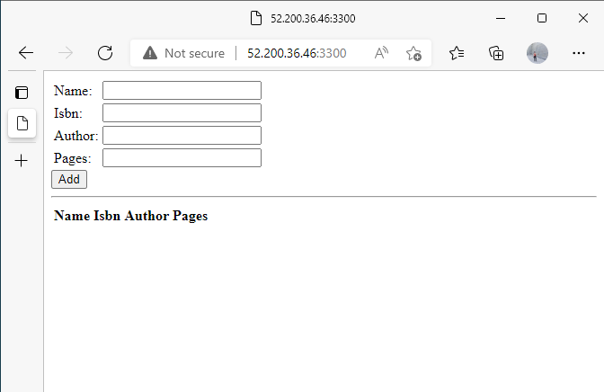

# **INSTALL NODE.JS**
`sudo apt install -y nodejs`
# **INSTALL MONGODB**
`sudo apt install -y mongodb`
## START THE SERVER
`sudo service mongodb start`
### verify the service is up and running
`sudo systemctl status mongodb`
### install npm
`sudo apt install -y npm
### install body-parser package to help process JSON files passed in requests to the server.
`sudo npm install body-parser`
### create a new directory named 'Books' and change directory into it
`mkdir Books && cd Books`
### in the Books directory run the command `npm init` to intiate npm for the project
### create a new file named server.js in the books directory, open the configuration terminal copy and paste the following code

# **INSTALL EXPRESS AND SET UP ROUTES TO THE SERVER**
### install express mongopse
`sudo npm install express mongoose`
### In the books folder create another folder named apps
`mkdir apps && cd apps`
### in the folder apps create a file named routes.js

# **Access the routes with AngularJS**
### Change directory to books
`cd ../ ..`
### Inside the books directory create a folder named public
`mkdir public && cd public`
### Inside the public folder create a file named script.js
`nano script.js`
### copy and paste the following code

### In the public folder create another file named index.html
`nano index.html`
### Copy and paste the code below

### change the directory back to books
` cd .. `
## Start the server.js by running
`node server.js`
### The server is now up and running and we can connect it via port 3300
`curl -s http://localhost:3300`
